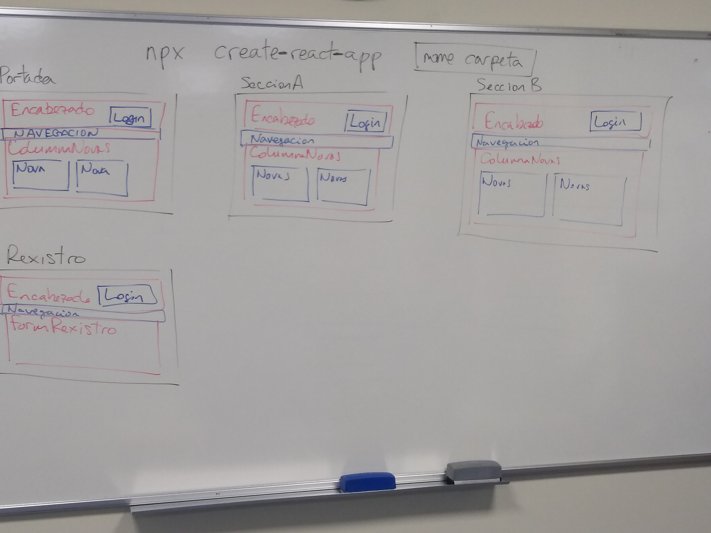

- [Introducción a React](#introducción-a-react)
  - [Inicio de un proyecto de react](#inicio-de-un-proyecto-de-react)
    - [Creando un proyecto desde cero](#creando-un-proyecto-desde-cero)
    - [Clonando un repositorio Git de un proyecto ya existente](#clonando-un-repositorio-git-de-un-proyecto-ya-existente)
  - [Puesta en marcha del proyecto](#puesta-en-marcha-del-proyecto)
  - [Componentes](#componentes)
    - [Declaración](#declaración)
    - [Invocando/llamando/usando el componente](#invocandollamandousando-el-componente)
    - [Expresiones de JavaScript en el HTML de un componente](#expresiones-de-javascript-en-el-html-de-un-componente)
    - [Pasando propiedades (props) a un componente](#pasando-propiedades-props-a-un-componente)
    - [Renderizado condicional (ahora lo ves, ahora no lo ves)](#renderizado-condicional-ahora-lo-ves-ahora-no-lo-ves)
    - [Generación de HTML y componentes personalizados a partir de arrays de datos](#generación-de-html-y-componentes-personalizados-a-partir-de-arrays-de-datos)
  - [Incluyendo archivos](#incluyendo-archivos)
    - [Imágenes](#imágenes)
    - [CSS](#css)
    - [Módulo CSS](#módulo-css)
  - [Hooks](#hooks)
    - [useState](#usestate)


# Introducción a React

## Inicio de un proyecto de react

### Creando un proyecto desde cero
```shell
$ npx create-react-app nombre-de-la-carpeta-del-nuevo-proyecto
```
### Clonando un repositorio Git de un proyecto ya existente
```shell
$ git clone url-clonado-repo-github
$ cd carpeta-repositorio
$ npm install
```

## Puesta en marcha del proyecto
```shell
$ npm start
```
## Componentes
### Declaración
```jsx
function NomeDelComponente() {
    // Aquí o teu JavaScript
    return (
        <>
        {/* Aquí o teu HTML>
        </>
    )
}
```
Para ver como incluir CSS, consulta [Módulos CSS](#módulo-css)
### Invocando/llamando/usando el componente
```jsx
import NomeDelComponente from "../ruta/al/fichero/del/componente"
function EsteComponenteUsaAlAnterior(){
    return (
        <>
        <NombreDelComponente/>
        </>
    )
}
export default EsteComponenteUsaAlAnterior
```
### Expresiones de JavaScript en el HTML de un componente
```jsx
function NomeDelComponente() {
    let titulo = "Este es el título."
    return (
        <>
        <h1>{titulo}</h1>
        </>
    )
}
```
### Pasando propiedades (props) a un componente
Este es el componente que recibe las propiedades
```jsx
function NomeDelComponente(props) {
    return (
        <>
        <h1>{props.titulo}</h1>
        </>
    )
}
```
Esta es la forma de proporcionarle las propiedades
```jsx
import NomeDelComponente from "../ruta/al/fichero/del/componente"
function EsteComponenteUsaAlAnterior(){
    return (
        <>
        <NombreDelComponente titulo="Este es el titulo."/>
        </>
    )
}
export default EsteComponenteUsaAlAnterior
```
Mediante propiedades (`props`) podemos transmitir, enviar o pasar a componentes hijos cualquier "cosa" a los hijos directos: `strings`, numeros, booleandos... pero también `arrays`, objetos o ¡funciones y componentes!.

### Renderizado condicional (ahora lo ves, ahora no lo ves)
En múltiples ocasiones interesa mostrar componentes o bloques de HTML de forma condicional. Un ejemplo puede ser mostrar el área privada de la aplicación sólo cuando se ha iniciado una sesión. Suele realizarse empleando el operador `&&` de JS.

```jsx
import PanelPrivado from "../ruta/al/fichero/del/PanelPrivado"
import Login from "../ruta/al/fichero/del/Login" 
function AreaDeUsuario(props) {
    return(
        <>
        {propos.sesionIniciada === true && <PanelPrivado>}
        {propos.sesionIniciada === false && <Login>}
        </>
    )
}
export default AreaDeUsuario
```
### Generación de HTML y componentes personalizados a partir de arrays de datos
React puede manejar arrays dentro del código HTML entregado por los componentes. La manera en que lo hace es descomponiendo el array y tratando cada uno de los elementos del mismo como si estubiese escritos secuencialmente en el contenido del return. Es decir, en el siguiente ejemplo, los elementos HTML guardados en el array de la constante elementosDeLaLista se mostrarán como si los hubiesemos escrito directamente en la etiqueta `<ul>`:
```jsx
import EjemploDeLista(){
    const elementosDeLaLista = [
        <li>Una cosa</li>,
        <li>Otra cosa</li>,
        <li>Una última cosa</li>
    ]
    return (
        <ul>
            {elementosDeLaLista}
        </ul>
    )
}
```
Esto asienta las bases para poder generar elementos HTML o componentes personalizados en base al contenido de arrays de datos, usando el metodo `.map`([w3schools](https://www.w3schools.com/jsref/jsref_map.asp)) de los array y las funciones flecha de JavaScript para crear un array con los elementos personalizados:
```jsx
import TarjetaLibro from "../ruta/al/fichero/del/TarjetaLibro"
function ColeccionLibros() {
    const libros = [
        {titulo: "Cosas de React", portada: "/images/portada123.png"},
        {titulo: "React para Dummies", portada: "/images/portada666.png"},
        {titulo: "React o no React", portada: "/images/portada042.png"},
    ]
    const tarjetasLibros = libros.map(
        cadaLibro => <TarjetaLibro titulo={cadaLibro.titulo} portada={cadaLibro.portada}/>
    )
    return (
        <section>
            <h2>Libros en la colección</h2>
            {tarjetasLibros}
        </section>
    )
}
```

## Incluyendo archivos
### Imágenes
```jsx
import nombreParaImagen from "ruta/fichero/imagen.png"
function NombreComponente(){
    return (
        
    )
}
export default NombreComponente
```
### CSS
Empregar sólo para el CSS global, que afectará a todo el HTML de la aplicación independientemente del componente del que proceda.
```jsx
// ./NombreComponente.jsx
import "./NombreComponente.css"
function NombreComponente(){
    return (
        <h1>Mi aplicación</h1>
    )
}
export default NombreComponente
```
```css
/* ./NombreComponente.css */
h1 {
    text-align: center;
}
```
### Módulo CSS
Emplear de forma generalizada para proporcionar CSS exclusivo a un componente, sin riesgo de que el HTML de otros componentes se vea afectado.
```jsx
// ./NombreComponente.jsx
import styles from "./NombreComponente.module.css"
function NombreComponente(){
    return (
        <h1 className={styles.nombreClaseCSS}>Mi aplicación</h1>
    )
}
export default NombreComponente
```
```css
/* ./NombreComponente.module.css */
.nombreClaseCSS {
    text-align: center;
}
```
## Hooks

### useState
Es el hook más frecuente en los componentes. Resulta dificil hacer un componente de React que no emplee `useState`.

Tienen dos finalidades:
- Permiten que los componentes de React "recuerden" valores.
- Permiten que React sea notificado de cambios en estos valores para que puede actualizar la información relacionada que se muestra en la pantalla.

Está compuesto de una constante en la que se almacena el estado que pretendemos que el componente recuerde y una función que nos permite actualizar el valor del estado.

Ejemplo de contador:

```jsx
// Impotamos useState para poder usarlo
import { useState } from "react";
function Contador () {
    // Creamos el estado y asignamos el valor inicial con useState
    const [ contador, setContador] = useState(0)
    function manexadorDoClick () {
        // Usamos el setter cuando queremos cambiar el valor del estado
        setContador(contador+1)
    }
    return (
        <>
        {/* Usamos o estado para acceder ó valor */}
        <p>Total: {contador}</p>
        <button onClick={manexadorDoClick}>
            Contar
        </button>
        </>
    )
}
export default Contador
```
Ejemplo de useState para controlar elementos de formulario:
```jsx
import { useState } from "react"
function Registro() {
    let [ nombre, setNombre ] = useState("")
    /**
    El manejador se encarga de acceder al contenido introducido en el input
    y de actualizar con el el valor del estado.
    */
    function manejadorDeEntradasEnNombre(evento) {
        const nuevoValor = evento.target.value
        setNome(nuevoValor);
    }
    return (
        <>
        <label>
            Nombre:
            {/*
                Actualizamos el valor del input asignandole el 
                valor almacenado en el estado.
                Cuando se introduce un nuevo valor en el input llamamos
                al manejador para actualizar el estado.
            */}
            <input type="text" name="nombre" value={nombre} onInput={manejadorDeEntradasEnNombre}/>
            <p>Este es el contenido en maiusculas: {nombre.toUpperCase()}</p>
        </label>
        </>
    )
}
export default Rexistro
```